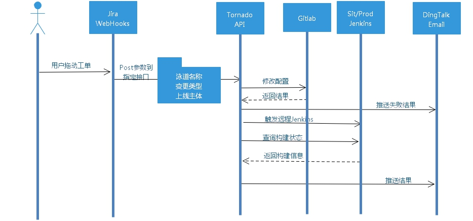

-------------------------------
## 一、Interview

Self-Help Release（简称SHRL）是一个面向企业技术人员的自助发布平台。

自助发布平台旨在为技术人员提供更便捷、更快速、更安全的上线环境，解决以往上线过程中出现的慢、难、乱等痛点。本平台致力于解决用户实际需求，搭建[Jira审批-Jenkins构建]之间的桥梁，前置应用上线步骤，缩短产品交付周期。目前除了基本的上线功能，还实现了预约上线、配置变更、实时日志、网络防抖等实用功能，基于邮箱、钉钉提供即时上线信息。

自助发布平台使用Python3作为开发语言，选用Tornado Web框架，具有高并发、高性能、易于开发的特点。此外采用了微服务架构设计，具有较强的可扩展性，易于监控且支持平滑升级。系统的部署发布可以支持传统方式和容器方式。

在技术架构上，我们的核心聚焦于上线体验，基于CMDB聚合各类元数据，实现精准上线。同时不断贴近用户操作的场景未来，我们将基于自助发布实现更多有价值功能，敬请期待，欢迎对此感兴趣的同仁能够参与其中。

## 二、Overview
### 2.1、架构设计


### 2.2、时序图

### 2.3、代码目录
- app
   - operatecfg.py：对接配置GitLab，实现配置文件的增改功能
   - operatedb.py：对接MySQL数据库，记录发布信息，同时提供信息源
   - operatejira.py：对接Jira，管理发布单，定时归档
   - operatejks.py：对接Jenkins，远程触发Jenkins构建
   - system.py：获取空闲随机端口，调用系统命令，管理日志文件
   - webtail.py：展示实时Jenkins Console日志
- conf
    存放应用所需相关配置
- docs
    项目说明文档及相关静态文件
- static
    实时日志相关
- templates
    首页模板

## 三、Features
- 业务模块：以项目为范畴，细化子模块，精细化上线
- 配置变更：基于GitLab模块点对点增改配置文件
- 预约上线：结合系统广播通知，自行把控上线时间
- 多重环境：一套系统多个环境，基于泳道命名自适配
- 权限管理：基于CMDB实现的RBAC管理功能
- 操作审计：设定Jira泳道，审计与回溯上线功能
- 事件推送：支持Plain、Html、Image等富文本多媒体通知
- 迭代记录：记录及反馈每一次迭代，每一次修复

## 4、Getting started
### 4.1、上线工单


### 4.2、发布状态 
**4.2.1、准备阶段**    
准备阶段意为自助发布平台已收到上线请求，后台基于请求参数进入处理中。    

  
**4.2.2、开始阶段**  
后台根据预设规则进入鉴别、判断，并输出最终验证结果  
  
如配置格式不对，则显示相关错误信息  
  

**4.2.3、发布完成**  
后台判断Jenkins构建状态，成功之后会发出钉钉及邮件信息。    
  

**4.2.4、构建失败**  
 如请求参数不合法或构建失败，平台会给出详细信息。  
  
构建失败之后，可直接查看失败日志  
  

### 4.3 预约上线
自定义上线时间，准时触发。为杜绝上线事故，最长预约时间不得超过1小时。  
  
如时间选择错误，则会收到如下信息。  
  
注意点：1、上午|下午、2、时间不能超过1小时  
  
  
### 4.4 变更配置
通过自助发布只能新增或修改配置，均不能删除，请各位保持代码清洁性，仅支持配置格式为：properties，不再适配yaml。

### 4.4.1 选择格式 
如需变更配置，则需制定配置格式。否则一律选"无"


### 4.4.2 配置约定    
- 配置名称    
    名称应遵循以下规则：
    - 1、配置目录名称必须要与Celebi-Cfg仓库中一致，该名称由开发第一次上线时提供并约定；  
    - 2、配置目录中的配置文件名称应与环境相吻合，必须为：application-{staging|prod}.properties;  

- 配置内容
    内容应遵循以下规则：
    - 1、每行中如没有'='号，则此份配置错误，不进行变更  
    - 2、每行中如没有'='号，则此份配置错误，不进行变更  
    - 3、左边或右边不存在英文或数字，则此份配置错误，不进行变更  

反例：
```
server.port             #空配置
manage.port=            #Key为空
=8080                   #Value为空
spring.redis.host=/     #換行
6379
spring.redis.port=*     #特殊字符
=                       #作死字符
```

成功的案例：  


### 4.5、实时日志
曲线解决Jenkins权限问题导致上线过程中无法实时查看Jenkins Console Output；需注意的是该功能基于WebSockets实现，仅能查看点开之后新增的日志，因此如需查看完整日志请及时点开‘开始环节’中Console链接。  
PS：基于安全考虑，实时日志已屏蔽线上主机名。


## 五、Version plan
* [版本迭代](docs/CHANGELOG.md)

## 六、Support
1. 阅读 [wiki]() 或者寻求帮助
2. 联系我们，钉钉沟通群：11763284

## 七、FAQ
7.1、XD自助发布和LC自助发布有什么异同点？  
SHRL自助发布平台为XD SRE运维团队为信贷技术体系研发的应用平台，所有操作均使用Python Model实现。

7.2、平台化啥时候能上线？  
预计在今年六月份会出第一版，基于Django实现的Web UI，后续也将替代掉Tornado接口。

## 八、邮件申请模板

Dear xxx开发经理、xxx测试经理、xxx运维经理：
    xxx 项目申请接入自助发布平台, 现申请开通自助发布平台开发经理、测试经理托单权限。请帮忙审批，请运维同事协助配置。
    相关信息如下：

- 项目：
    - 名称：项目一
    - JobName：SHRL_xx（SHRL_my-app）
- 配置：
    - 仓库对应目录：SHRL_xxx -> dir_name（SHRL_my-app -> my-app）   
- 权限：
    - 开发组长（经理）： xxx
    - 测试组长（经理）： xxx
 
